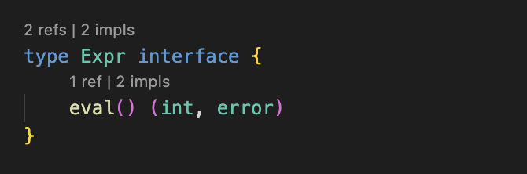
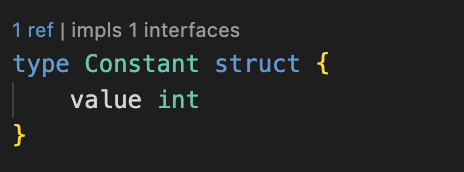
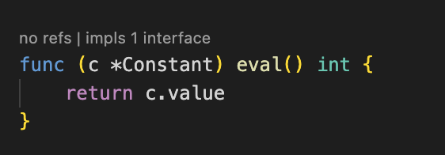
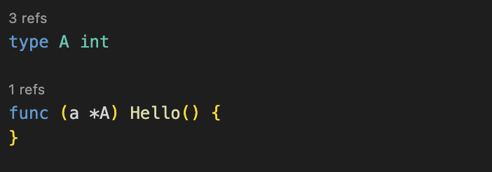
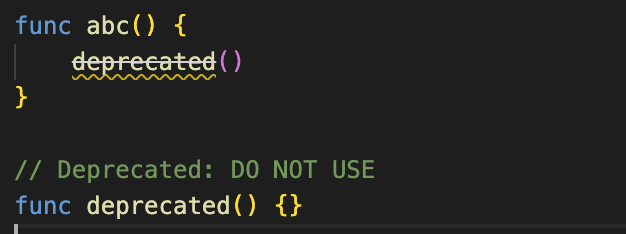
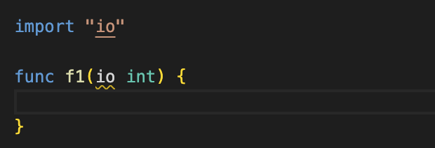
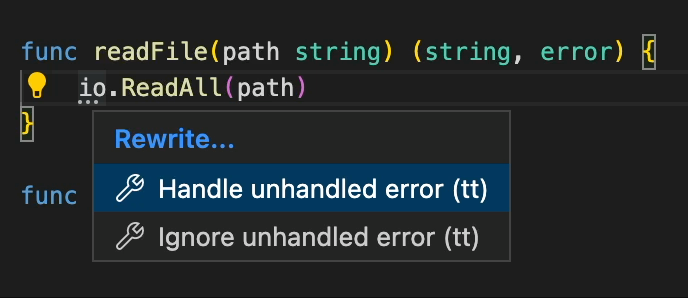
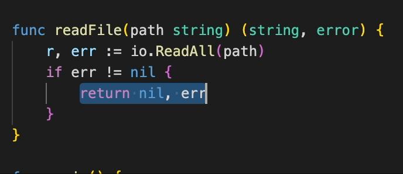

# Tooltitude VS Code Extension

Tooltitude is a productivity extension for the Go programming language. It helps you write better code faster. The extension is being actively developed so stay tuned for new features (Twitter is the best place to do so https://twitter.com/tooltitude)

## Code Lenses
We have code lenses which help you be more productive

### Interface Implementations

### Interfaces Implemented by a Type

### Interface Method Implemented by a Method

### References

## Inspections
Inspections look into your code and find potential problems

### Deprecated symbols

### Shadowed symbols

## Code Actions
We have more than 20 code actions (and counting). To use code action, put a caret on an applicable code element. If there're code actions, a light bulb icon will apear. You could click on it with a mouse, press Ctrl+. (on Windows and Linux) or Cmd+. (on Mac). The menu will appear where you choose actions. Actions from this extension have (tt) market on the right to distinguish them from code actions from other extensions.

### Handle Error

## Feature list

- Code Lenses
  - Reference counts for functions, method, structs, interfaces, struct fields, and interface methods
  - Run or debug main packages from a code lens
- Inspections
  - Show variable shadows
  - Show deprecated symbol usages
- Code Actions
  - Handle error (with panic, return err, wrapped error)
  - Extract variable
  - Apply De Morgan Laws
  - Merge String Literals
  - Flip comma
  - Invert if conditions
  - Convert else { if { to else if {
  - Unwrap else code action (return in the if-true block)
  - Iterate over collection
  - Convert raw string <-> string literal
  - Convert separated decimal literal <-> non separated decimal literal (i.e. 1000000 <-> 1_000_000)
  - Add/remove octal prefix in octal literals (i.e. 0100 <-> 0o100)
  - Convert defer to "multiline" defer (via closure)
  - Add else to if
  - Add channel receive result to assignment
  - Remove redundant parenthesis
  - Convert interface {} to any
  - Convert assignment to unresovled variable to short var decl
  - Flip binary operation, i.e. a + b -> b + a and a > b to b < a
  - Convert x += a to x = x + a and back, as well as with other operations
  - Anonymous func single line to/from multiline func
  - Add var type
  - Rune literal to/from string literal
  - Var to/from short var declaration
  - Split field
  - Merge imports

## Data
We collect anonymous usage data in order to improve the extension. In order to opt-out of data collections, turn off application-wide telemetry setting in VS Code as directed by the VS Code documentation before installing the extension: https://code.visualstudio.com/docs/supporting/faq#_how-to-disable-telemetry-reporting Our extension respects this global setting as directed by extension guidelines published by Microsoft.

## Support Resources

* You could ask for help or suggest a feature by creating an issue in this repository: https://github.com/tooltitude/support/issues/new/choose
* You could join our Discord community: https://discord.gg/f9MHBXsVwr

## Other Links

* Visit our site: https://www.tooltitude.com/
* Follow us on Twitter: https://twitter.com/tooltitude
