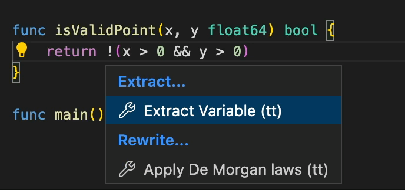
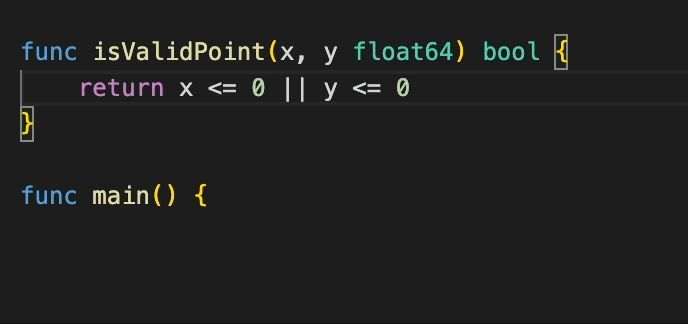
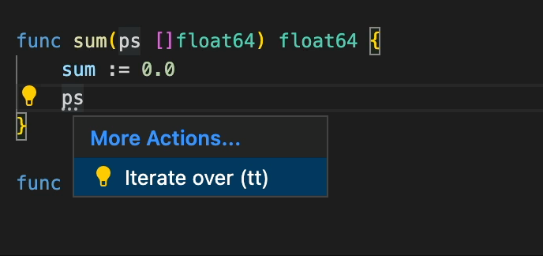
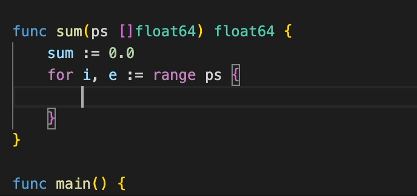

# Tooltitude VS Code Extension

Tooltitude is a productivity extension for the Go programming language. It helps you write better
code faster. Here's are some highlights of its features

## Code Actions

### Handle Error

### Apply De Morgan Laws

### Iterate Over Collection

We have more than 15 code actions in addition to these highlights. Install the extension, and try it for yourself or read more on https://www.tooltitude.com/

## Support Resources

* You could ask for help or suggest a feature by creating an issue in this repository: https://github.com/tooltitude/support/issues/new/choose
* You could join our Discord community: https://discord.gg/f9MHBXsVwr

## Other Links

* Visit our site: https://www.tooltitude.com/
* Follow us on Twitter: https://twitter.com/tooltitude
