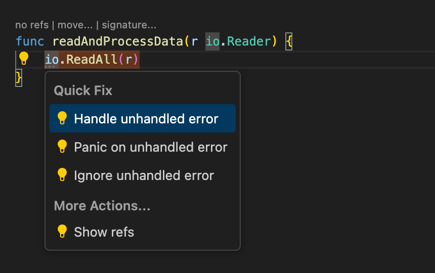

# Tooltitude for Go

[Tooltitude for Go](https://www.tooltitude.com) is a productivity extension for the Go (GoLang) programming language.

## Features

### CodeLens Providers in Project Modules
Gain insights into your Go codebase, and understand usage patterns of functions, methods, fields, and interfaces.
We have CodeLens providers which help you navigate code and see what's going on in the codebase.

### Code Inspections
From unused initializations and writes to shadowed variables, unhandled errors, and deprecated symbols, our inspections help you enhance your Go code.

### References View
Our references view is tailored for Go. It allows you to see not only the file where the reference is located, but its package, and containing element (e.g. a function). Note: it works only with Tooltitude for Go CodeLens providers.

### Debug Individual Table Driven Tests
Debug Individual table driven tests with our CodeLens provider.

### Postfix Completions
Write Go code faster by using familiar dot notation to generate boilerplate: generate statements, call library functions, iterate over collections and more.

### Code Actions
Make common Go code changes with confidence: handle errors, manipulate variables, transform expressions and more.

## Premium Features
We have a set of premium features which are available on a subscription basis.
Learn more about them https://www.tooltitude.com/pricing

### ⭐ CodeLens Providers in Dependencies
Gain insights into your Go dependencies, understand usage patterns of functions, methods, fields, and interfaces.

### ⭐ Inline Values In The Debugger
See variable and parameter values right in your editor while debugging Go programs.

### ⭐ Workspace Wide Unused Symbols Report
Find Go entities with no Go source code references in the workspace.

### ⭐ Inlay Reference Counters
Save vertical space with inlay reference.

### Full LSP mode
Tooltitude for Go could act not only as a productivity extension, but as a Go language server. It could be used in a resource constrained environment where running both gopls and Tooltitude for Go isn't feasible.

This mode is activated only if the official Go extension is disabled. It's possible to disable it either globally or on a per-workspace basis. Then, reload the editor to activate the mode.

## Feature list
See the full feature list here: https://www.tooltitude.com/features

## Data
You could read about data collection in our privacy policy: https://www.tooltitude.com/privacy

## Support Resources
* Report an issue: https://github.com/tooltitude/support/issues/new/choose
* Discord community: https://discord.gg/f9MHBXsVwr

## Other Links
* Our site: https://www.tooltitude.com/
